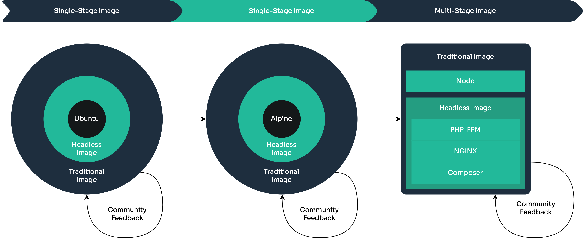

# Sylius Docker Standard

## Introduction
The Sylius Docker Standard is a newly created docker base image available for everyone as part of Sylius Open Source.
The key idea is to keep it simple and provide one image shared between environments.
Feel free to fork, extend or copy source files.

### Drivers
#### 1. Ubuntu LTS based image
Yes, it is bigger than Alpine, yet a popular and easily extendable base.
Like, Ubuntu is the most popular/known Linux distro.

#### 2. All in one
The image provides PHP with [PHP-FPM](https://www.php.net/manual/en/install.fpm.php) with many extensions and production-ready configuration, [NGINX](https://www.nginx.com) as a reverse proxy, and Node.js to build a frontend that is compatible with related to the Sylius version.

#### 3. Single Stage Build
Multi-Stage Builds are cool, smaller sizes, and probably an overall better approach. But they tend to create Dockerfile
much more complicated for people that are starting their journey with Docker.

#### 4. Example Driven Documentation ([soon to be](https://github.com/Ferror))
The deployment [docs](https://docs.sylius.com/en/latest/getting-started-with-sylius/deployment.html) did not get much love.
It's going to change. We will provide cookbooks and best practices on how to deploy your Sylius project.

#### 5. [KISS Principle](https://en.wikipedia.org/wiki/KISS_principle)

> Need something optimised or advanced? Contact ([Zbigniew Malcherczyk](https://github.com/Ferror)) via email or [slack](https://sylius-slackin.herokuapp.com).

## Metadata
| Image              | Size                                                                           |
|--------------------|--------------------------------------------------------------------------------|
| `1.11-traditional` |  |
| `1.11-headless`    |     |

> Please note that image sizes may differ in each architecture.

## Supported Architectures
* linux/amd64
* linux/arm64
* linux/arm/v7
* linux/arm/v8

> Proudly hosted on [Docker Hub](https://hub.docker.com/r/sylius/standard)

## Images
### Traditional

The Traditional image is everything you require to run a traditional eCommerce platform on Sylius.
The image contains PHP, NGiNX, and Node.js compatible with the Sylius version.
Example Sylius `1.11` will work best with `sylius/standard:1.11-traditional` image.

### Headless

Headless eCommerce is getting more and more popular. The Headless image is a node-less Traditional image that will save you some space when you would like to use Sylius as a service.

## Roadmap

